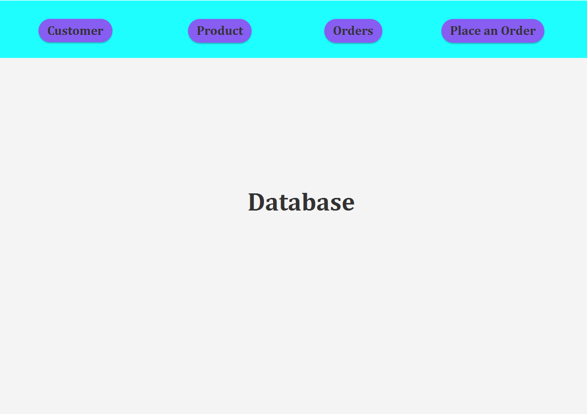
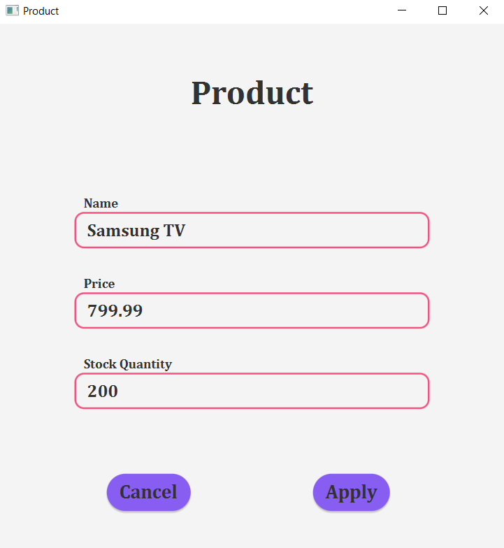

# Order Management Application

## Problem and Solution

**Problem**: Traditional methods of managing products, clients, and orders for a warehouse, such as handwritten registries, are cumbersome and prone to errors.

**Solution**: We propose the development of a robust application specifically designed to streamline the process of managing client orders within a warehouse environment.

## Analysis

### Use Case: Add Product

**Primary Actor**: Employee

**Main Success Scenario**:
1. An employee initiates the process to add a new product to the inventory.
2. The application presents a user-friendly form for entering the product details.
3. The employee inputs the product's name, price, and current stock level.
4. Upon verification, the employee submits the information by clicking "Add".
5. The application securely stores the product data in the database and confirms the successful addition.

**Alternative Sequence: Invalid Values for Product's Data**:
- If the employee attempts to input invalid data, such as a negative stock value, the application prompts an error message, guiding the user to correct the input.
- The workflow returns to step 3 for the employee to provide valid data.

### Functional Requirements:
- **Add New Client**: Employees should be able to add new clients to the system.
- **Add New Product**: Employees should have the capability to add new products to the warehouse inventory.
- **Place a new Order**: Admins can place a new order by selecting a custoemr and then choosing the appropriate quantity for the needed products
- **Visualize the orders**: 

### Non-Functional Requirements:
- **Intuitive User Interface**: The application must offer a user-friendly interface, ensuring ease of use and navigation for employees.
- **Efficient Performance**: The system should be responsive and capable of handling operations efficiently, even under heavy load.

## Design

### Conceptual Architecture

- **Presentation Layer**: Encompasses the user interface components responsible for interacting with users.
- **Business Layer**: Houses the application's core logic, including product and order management functionalities.
- **Data Access Layer**: Manages the interaction with the database, handling queries and data retrieval operations.

### Detailed Architecture

The architecture is designed with a layered approach, ensuring clear separation of concerns and facilitating modularity and scalability.

### Processing SQL Statements

1. **Establish Connection**: Connect to the database to execute SQL statements.
2. **Create Statement**: Define SQL statements to perform database operations.
3. **Execute Query**: Execute the prepared SQL statements.
4. **Process ResultSet**: Handle the results obtained from the executed query.
5. **Close Connection**: Properly close the database connection to release resources.

### Establishing a Connection

- The application establishes a connection using JDBC, providing necessary authentication credentials and connection parameters.
- A Singleton pattern is employed to manage the database connection instance, ensuring a single, shared connection across the application.

### Table Mapping

- Entity classes are created to map database tables, ensuring alignment between database schema and application data model.
- These classes include fields corresponding to table columns, along with constructors, getters, and setters for data manipulation.

### Dependencies

- JDBC library is added to the project dependencies to facilitate database interaction from the Java application.
- This library enables the execution of SQL queries and processing of query results, enhancing the application's functionality.

### Creating and Executing Statement

1. Define SQL queries to perform database operations such as insertion, deletion, or retrieval.
2. Establish a database connection to execute the prepared SQL statements.
3. Initialize the query with appropriate parameters.
4. Execute the query to perform the desired database operation.
5. Handle any exceptions and errors that may occur during query execution.

### Processing ResultSet

- The results obtained from query execution are stored in a ResultSet object.
- The ResultSet can be iterated to access individual records retrieved from the database.
- Data from ResultSet is processed as per application requirements, enabling manipulation and display of retrieved information.

## Pictures

